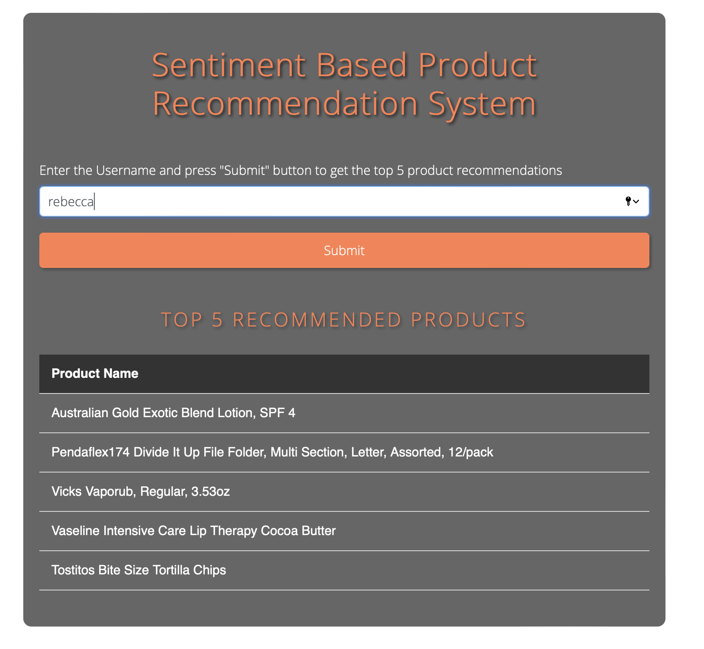

# Sentiment Based Product Recommendation System
```
Predicts the sentiment (positive or negative) of reviews for the top 20 recommended products for a user. This involves calculating the percentage of positive sentiments for each recommended product and filtering out the top 5 products with the highest percentage of positive reviews.

The application will take a username as input and, upon pressing the submit button, recommend 5 products based on the username entered
```

### Run on local
Create a container from the image.
```
$ git clone https://github.com/prashant-dwivedi11/Sentiment-Based-Product-Recommendation-system.git
$ pip install -r requirements.txt
$ python app.py
```

Now visit http://127.0.0.1:8080

### Run using docker
Create a container from the image.
```
$ docker build -t product_recommendation_system .
$ docker run -p 8080:8080 product_recommendation_system
```

Now visit http://127.0.0.1:8080

### Sample Run

